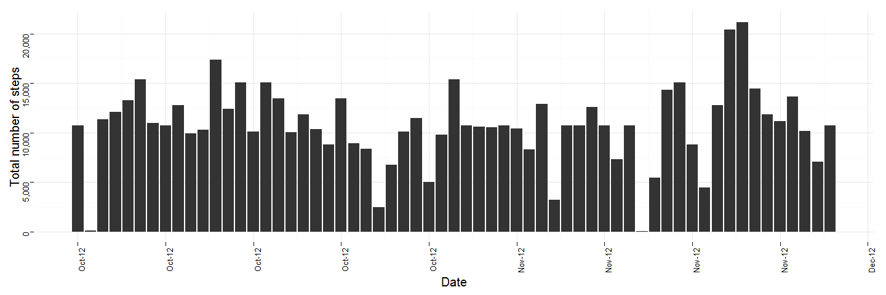

 
=========================

##Loading and preprocessing the data

####1. Load the data

Here we use 'read.csv' if the file exists.  
If the file doesn't exist, we stop the code.


```r
if(!file.exists('activity.csv')) {
  
  stop("Data file not found")

} else {

  data <- read.csv('activity.csv')
  # data <- read.csv(file.choose())
  
  }
```

####2. Process/transform the data into a format suitable for your analysis.

Here we make sure the date is in the date format.


```r
data$date<-as.Date(data$date)
```

##What is mean total number of steps taken per day?

####1. Calculate the total number of steps taken per day

Here we make a data frame with two columns (date, total number of steps).  
We then re-name the columns appropriately.


```r
sumdata = aggregate(data$steps, list(data$date), sum, na.rm=TRUE)
colnames(sumdata) = c("date","steps")
```

####2. Make a histogram of the total number of steps taken each day.

Here we create a histogram using the date frame created above.  
We use ggplot2 features to make it more aesthetically appealing.


```r
library(ggplot2)
library(scales)

ggplot(sumdata, aes(sumdata$date,sumdata$steps)) + 
  geom_histogram(stat="identity") + 
  scale_x_date("Date", 
               labels = date_format("%b-%y"), 
               breaks = date_breaks("1 week")) +
  scale_y_continuous("Total number of steps", 
                     labels = comma) +
  theme_minimal() +
  theme(axis.text.x = element_text(size=10,angle=90,colour="black",vjust=1,hjust=1))+
  theme(axis.text.y = element_text(size=10,angle=90,colour="black",vjust=1,hjust=1))+
  theme(axis.title  = element_text(size=15))
```

 

####3. Calculate the mean and median of the total number of steps taken per day


```r
meandata = mean(sumdata$steps)
print(paste("Mean number of steps per day: ",format(round(meandata))))
```

```
## [1] "Mean number of steps per day:  9354"
```

```r
mediandata = median(sumdata$steps)
print(paste("Median number of steps per day: ",format(round(mediandata))))
```

```
## [1] "Median number of steps per day:  10395"
```


##What is the average daily activity pattern?


####1. Make a time series plot of the 5-minute interval and average number of steps, averaged across all days.

Here we make a data frame with two columns (inverval, mean number of steps).  
We then re-name the columns appropriately.


```r
meandata = aggregate(data$steps,list(data$interval),mean,na.rm=TRUE)
colnames(meandata) = c("interval","mean")
```

Now we create a time-series plot


```r
ggplot(meandata, aes(meandata$interval,meandata$mean)) + 
  geom_line(stat="identity") + 
  scale_x_continuous("5-min Interval", 
                     labels = comma) +
  theme_minimal() + 
  #xlab("5-min Interval") + 
  ylab("Mean Number of Steps")
```

 

####2. Which 5-min interval, on average across all days, contains the maximum number of steps?


```r
maxinterval = meandata[which.max(meandata$mean),1]
print(paste("Inverval with maximum number of steps: ",format(round(maxinterval))))
```

```
## [1] "Inverval with maximum number of steps:  835"
```


##Imputting missing values

####1. Calculate and report the total number of missing values in the dataset (i.e. rows with NAs)


```r
missing = length(which(is.na(data$steps)))
print(paste("Number of missing values: ",format(round(missing))))
```

```
## [1] "Number of missing values:  2304"
```

####2. Devise a strategy for filling in all of the missing values in the dataset. 

We will find values with NA then fill with mean value for that interval across all other days that were not NA.

####3. Create a new dataset that is equal to the original dataset but with the missing data filled in.


```r
fillme <- function(steps, interval) {
    filled = NA
    if (!is.na(steps))
        filled = c(steps)
    else
        filled = meandata[meandata$interval==interval,2]
    return(filled)
}
fill = data
fill$steps = mapply(fillme, data$steps, data$interval)

print(paste("Number of NAs in filled array: ",format(length(which(is.na(fill$steps))))))
```

```
## [1] "Number of NAs in filled array:  0"
```

####4a. Make a histogram of the total number of steps taken each day. 


```r
sumfill = aggregate(fill$steps, list(fill$date), sum, na.rm=TRUE)
colnames(sumfill) = c("date","steps")


ggplot(sumfill, aes(sumfill$date,sumfill$steps)) + 
       geom_histogram(stat="identity")  + scale_x_date("Date", 
               labels = date_format("%b-%y"), 
               breaks = date_breaks("1 week")) +
  scale_y_continuous("Total number of steps", 
                     labels = comma) +xlab("Date") +
  theme_minimal() +
       theme(axis.text.x = element_text(size=10,angle=90,colour="black",vjust=1,hjust=1))+
       theme(axis.text.y = element_text(size=10,angle=45,colour="black",vjust=1,hjust=1))+
       theme(axis.title  = element_text(size=15))
```

 

####4b. Calculate and report the mean and median total number of steps taken per day. 


```r
meanfill = mean(sumfill$steps)
print(meanfill)
```

```
## [1] 10766.19
```

```r
print(paste("Mean number of steps per day: ",format(round(meanfill))))
```

```
## [1] "Mean number of steps per day:  10766"
```

```r
medianfill = median(sumfill$steps)
print(medianfill)
```

```
## [1] 10766.19
```

```r
print(paste("Median number of steps per day: ",format(round(medianfill))))
```

```
## [1] "Median number of steps per day:  10766"
```

####4c. Do these values differ from the estimates from the first part of the assignment? What is the impact of imputing missing data on the estimates of the total daily number of steps?

Both the median and mean have increased after imputing missing data.


##Are there differences in activity patterns between weekdays and weekends?

####1. Create a new factor variable in the dataset with two levels "weekday" and "weekend" indicating whether a given date is a weekday or weekend day.

Use the "weekdays" R function to determine the weekday for each date.  
Then categorize as a weekend or weekday.


```r
daytype <- function(date) {
  
    day = weekdays(date)
    
    if (day %in% c("Monday", "Tuesday", "Wednesday", "Thursday", "Friday"))
        return("Weekday")
    
    else if (day %in% c("Saturday", "Sunday"))
        return("Weekend")
    
    else
        stop("invalid date")
}


fill$date = as.Date(fill$date)
fill$daytype  = sapply(fill$date, FUN=daytype)
```

####2. Make a panel plot containing a time series plot of the 5-minute interval and the average number of steps taken, averaged across all weekday days or weekend days. 


```r
aggdata <- aggregate(data=fill, fill$steps ~ fill$daytype + fill$interval, FUN=mean)
colnames(aggdata) = c("daytype","interval","steps")

ggplot(aggdata,aes(interval,steps)) + 
  geom_line() + 
  facet_wrap(~daytype, ncol = 1) + 
  #facet_wrap(~ Type, ncol = 1,scales = "free_y" ) + 
  scale_x_continuous("5-min Interval", 
                     labels = comma) + 
  xlab("Date") +
  theme_minimal() + 
  ylab("Mean Number of Steps") 
```

 
